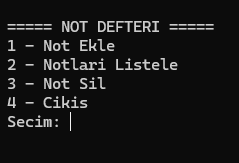

#Basit Not Defteri Uygulaması (Note Management System)
Bu proje, C programlama dili kullanılarak geliştirilmiş basit bir not defteri uygulamasıdır.
Kullanıcıların not ekleme, görüntüleme, düzenleme ve silme işlemlerini gerçekleştirmesine olanak sağlar.
Veriler dosya sistemi üzerinde saklanır ve program kapatılsa bile korunur.

## 🚀 Özellikler
* **1 - Not Ekle:** Yeni notlar oluşturun.
* **2 - Notları Listele:** Kaydedilen notları görüntüleyin.
* **3 - Not Sil:** İstediğiniz notu sistemden kaldırın.
* **4 - Çıkış:** Güvenli bir şekilde uygulamayı kapatın.
* ## 📸 Ekran Görüntüsü

